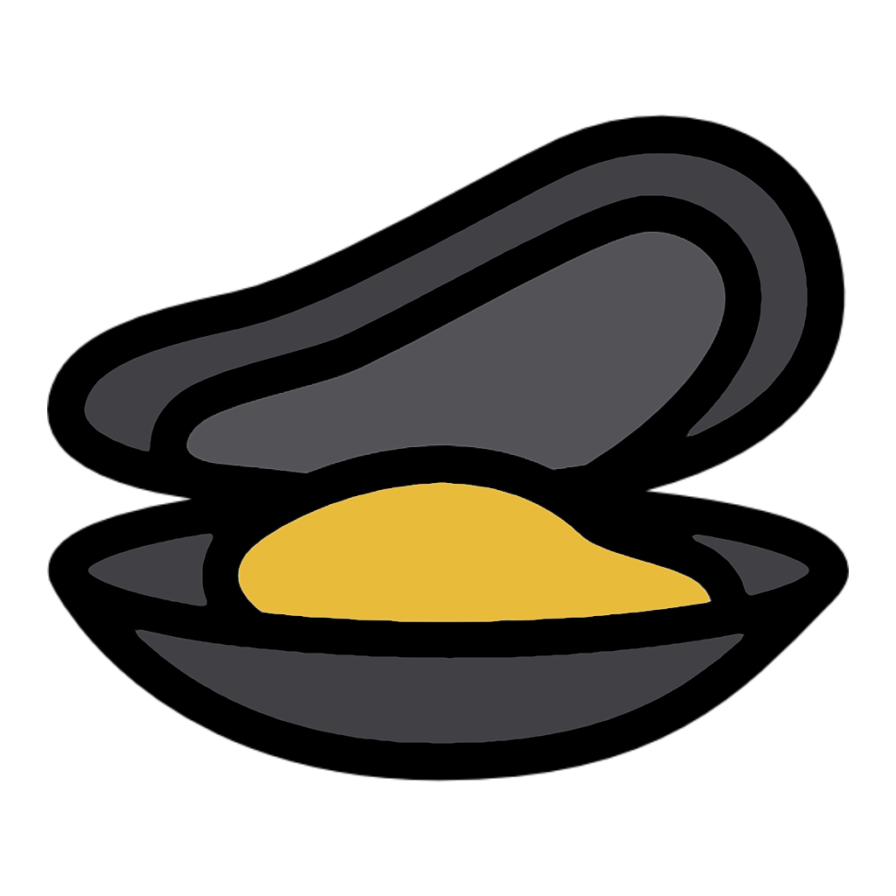
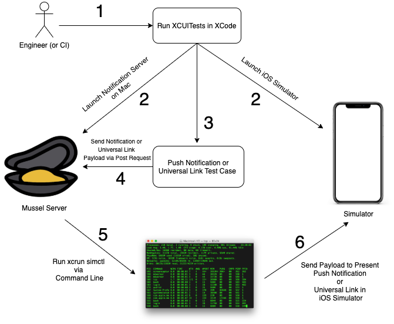

# Mussel 🦪💪 

A framework for easily testing Push Notifications, Universal Links and Routing in XCUITests.



As of Xcode 11.4, users are able to test Push Notifications via the simulator. Unfortunately, Apple has yet to introduce the ability to leverage this new method within the XCUITest Framework.

Testing Universal Links can also be an adventure, potentially accumulating lots of extra unwanted time in UI Tests, especially if your team wants to speed up your app's regression progress. Convential methods resorted to using iMessage or Contacts to open Universal Links which routed to a specific feature within an application.

Mussel introduces a quick and simple way to test Push Notifications and Universal Links which route to any specific features within your iOS app.

If you're interested, please visit our relative framework and fellow edible mollusc: <br/>
[Snail](https://github.com/UrbanCompass/Snail "Snail") - lightweight observables framework.

Let's Build some Mussel! 💪

# How it works


<br/>

1. An Engineer triggers XCUITests in XCode manually or through your Continuous Integration platform of choice.
2. Mussel Server boots up along with the iOS Simulator.
3. A Test Case triggers a Push Notification or Universal Link Test Case.
4. The Test Case sends a payload containing Push Notification or Universal Link data via POST Request.
5. Server runs respective `xcrun simctl` command for Push Notifications or Universal Links.
6. The command presents a Push Notification or launches a Universal Link within the iOS Simulator.

# Installation

Mussel currently supports Cocoapods

### Cocoapods

Add the Mussel pod to the project's **UI Test Target** in your `podfile`:
```
target 'ProjectUITests' do
    # Other UI Test pods....
    pod 'Mussel'
end
```

After installing the `Mussel` pod, add the following run script to the `Build Phases` for your respective **UI Test Target**

```
"${PODS_ROOT}/Mussel/scripts/run_notification_server.sh"
```

## Usage

First, import the Mussel framework to your `XCTestCase` file:
```
import Mussel
```
<br/>

### Push Notifications ####

<br/>
Initialize your `Mussel Tester` of choice, we'll start with the `MusselNotificationTester`. Use your Target App's Bundle Id to ensure notifications are sent to the correct simulator.

``` swift
let notificationTester = MusselNotificationTester(targetAppBundleId: "com.yourapp.bundleId")
```

Send a push notification with a simple message to your iOS Simulator:
```swift
notificationTester.triggerSimulatorNotification(withMessage: "Test Push Notification")
```

You can also send full APNS payloads for notifications with more complexity, supplying keys that are outside the `aps` payload. You can specify this payload as a Dictionary:
``` swift
    let testPayload = [
        "aps": [
            "alert": [
                "title": "Test title",
                "subtitle": "Test subtitle",
                "body": "Test body"
            ],
            "badge": 24,
            "sound": "default"
        ],
        "listingId": "12345"
    ]
```

This dictionary is equivalent to the following APNS payload:
``` json
{
    "aps": { 
        "alert": {
            "title": "Test title",
            "subtitle": "Test subtitle",
            "body": "Test body"
        },
        "badge": 24,
        "sound": "sound",
    },
    "listingId": "12345"
}
```

Then call `triggerSimulatorNotification` with your respective dictionary-converted APNS payload.

``` swift
notificationTester.triggerSimulatorNotification(withFullPayload: testPayload)
```

<br/>

### Universal Links ####

<br/>

Initialize your `MusselUniversalLinkTester` using your Target App's Bundle Id to ensure notifications are sent to the correct simulator.

``` swift
let universalLinkTester = MusselUniversalLinkTester(targetAppBundleId: "com.example.yourAppBundleId")
```

Trigger your iOS Simulator to open a Universal Link:
```swift
universalLinkTester.open("exampleapp://example/content?id=2")
```

## Examples

Here's a sample UI test that utilizes the Mussel framework for testing a __Push Notification__ use case:

```swift
import Mussel
import XCTest

class ExamplePushNotificationTest: XCTestCase {
    let app = XCUIApplication()
    let springboard = XCUIApplication(bundleIdentifier: "com.apple.springboard")
    let notificationTester = MusselNotificationTester(targetAppBundleId: "com.yourapp.bundleId")

    func testSimulatorPush() {
        waitForElementToAppear(object: app.staticTexts["Mussel Push Notification Example"])
    
        // Launch springboard
        springboard.activate()

        // Trigger a push notification to the simulator
        notificationTester.triggerSimulatorNotification(withMessage: "Test Notification Message")

        // Tap the notification when it appears
        let springBoardNotification = springboard.otherElements["NotificationShortLookView"]
        waitForElementToAppear(object: springBoardNotification)
        springBoardNotification.tap()

        waitForElementToAppear(object: app.staticTexts["Mussel Push Notification Example"])
    }

    func waitForElementToAppear(object: Any) {
        let exists = NSPredicate(format: "exists == true")
        expectation(for: exists, evaluatedWith: object, handler: nil)
        waitForExpectations(timeout: 5, handler: nil)
    }
}
```

Here's a sample UI test that utilizes the Mussel framework for testing a __Universal Link__ use case:
```swift
import Mussel
import XCTest

class ExampleUniversalLinkTest: XCTestCase {
    let app = XCUIApplication()
    let springboard = XCUIApplication(bundleIdentifier: "com.apple.springboard")
    let universalLinkTester = MusselUniversalLinkTester(targetAppBundleId: "com.example.yourAppBundleId")

    func testSimulatorPush() {
        waitForElementToAppear(object: app.staticTexts["Mussel Universal Link Example"])
    
        // Launch springboard
        springboard.activate()

        // Trigger a Universal Link to the simulator
        universalLinkTester.open("mussleSampleApp://example/content?id=2")

        waitForElementToAppear(object: app.staticTexts["Mussel Universal Link Example"])
    }

    func waitForElementToAppear(object: Any) {
        let exists = NSPredicate(format: "exists == true")
        expectation(for: exists, evaluatedWith: object, handler: nil)
        waitForExpectations(timeout: 5, handler: nil)
    }
}
```

## Attribution

The original Mussel Icon can be found on clipartmax.com

Big thanks to [Matt Stanford](https://github.com/mattstanford/ "Matt Stanford") for finding an elegant and unprecedented way to test Push Notifications on the iOS Simulator with [Pterodactyl](https://github.com/mattstanford/Pterodactyl "Pterodactyl")
